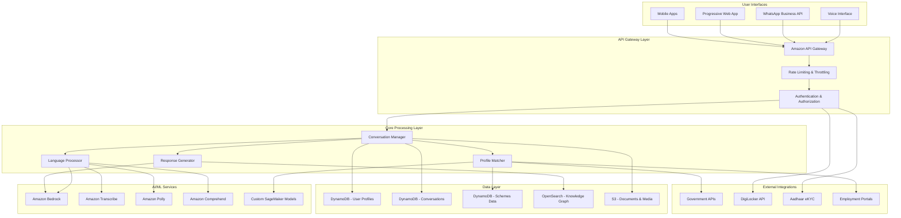

# Design Document: SamparkAI

## Overview

SamparkAI is a sophisticated, cloud-native AI platform designed to democratize access to government services across Bharat. The system leverages cutting-edge AWS AI services, conversational AI technologies, and advanced machine learning to provide voice-first, multilingual, and accessible public service assistance.

The platform operates on a serverless, microservices architecture that can scale from thousands to millions of concurrent users while maintaining sub-100ms response times. Key design principles include accessibility-first design, privacy-by-design, and resilience through intelligent failover mechanisms.

## Architecture

### High-Level Architecture



### Microservices Architecture

The system is decomposed into the following microservices:

1. **Conversation Service**: Manages multi-turn dialogues and context
2. **Language Service**: Handles translation, NLP, and speech processing
3. **Profile Service**: Manages user profiles and eligibility matching
4. **Content Service**: Manages government schemes and employment data
5. **Notification Service**: Handles proactive notifications and reminders
6. **Analytics Service**: Provides real-time analytics and insights
7. **Integration Service**: Manages external API integrations
8. **Security Service**: Handles authentication, authorization, and fraud detection

## Components and Interfaces

### 1. Voice Interface Component

**Technology Stack:**
- Amazon Transcribe with custom vocabulary for Indian languages
- Amazon Polly with neural voices and SSML support
- WebRTC for real-time audio streaming
- Noise cancellation using AWS AI services

**Key Features:**
- Support for 22+ Indian languages with dialect recognition
- Emotion detection and sentiment analysis
- Voice biometrics for secure authentication
- Adaptive audio quality based on network conditions

**Interface Specification:**
```typescript
interface VoiceInterface {
  startListening(sessionId: string, language?: string): Promise<AudioStream>
  stopListening(sessionId: string): Promise<TranscriptionResult>
  synthesizeSpeech(text: string, voice: VoiceConfig): Promise<AudioBuffer>
  detectEmotion(audioData: AudioBuffer): Promise<EmotionAnalysis>
  authenticateVoice(audioData: AudioBuffer, userId: string): Promise<AuthResult>
}

interface VoiceConfig {
  language: string
  voice: string
  speed: number
  pitch: number
  volume: number
}
```

### 2. WhatsApp Business API Integration

**Technology Stack:**
- WhatsApp Business API with Cloud API
- AWS Lambda for webhook processing
- Amazon SQS for message queuing
- Rich media support with S3 integration

**Key Features:**
- Interactive buttons and carousel cards
- Document upload and OCR processing
- Group conversation support
- Multimedia message handling

**Interface Specification:**
```typescript
interface WhatsAppInterface {
  sendMessage(phoneNumber: string, message: WhatsAppMessage): Promise<MessageResult>
  sendInteractiveMessage(phoneNumber: string, interactive: InteractiveMessage): Promise<MessageResult>
  uploadMedia(file: File): Promise<MediaUploadResult>
  processIncomingMessage(webhook: WhatsAppWebhook): Promise<void>
}

interface WhatsAppMessage {
  type: 'text' | 'image' | 'document' | 'audio' | 'video'
  content: string | MediaContent
  quickReplies?: QuickReply[]
}
```

### 3. Progressive Web Application

**Technology Stack:**
- React with TypeScript for frontend
- Service Workers for offline functionality
- IndexedDB for local data storage
- WebAssembly for performance-critical operations

**Key Features:**
- Offline-first architecture with intelligent sync
- Adaptive UI based on user's digital literacy
- WCAG 2.1 AAA compliance
- Progressive enhancement for low-end devices

**Interface Specification:**
```typescript
interface WebInterface {
  renderAdaptiveUI(userProfile: UserProfile): Promise<UIConfiguration>
  enableOfflineMode(essentialData: OfflineData): Promise<void>
  syncWhenOnline(): Promise<SyncResult>
  trackAccessibilityUsage(interactions: AccessibilityEvent[]): Promise<void>
}
```

### 4. Profile Matcher and Recommendation Engine

**Technology Stack:**
- Amazon SageMaker for ML model training and inference
- Amazon Personalize for recommendation algorithms
- Custom neural networks for eligibility assessment
- Real-time feature store using DynamoDB

**Key Features:**
- 95% accuracy in scheme eligibility prediction
- Real-time recommendation updates
- Explainable AI for decision transparency
- Continuous learning from user feedback

**Interface Specification:**
```typescript
interface ProfileMatcher {
  assessEligibility(profile: UserProfile, schemes: Scheme[]): Promise<EligibilityResult[]>
  generateRecommendations(userId: string, context: ConversationContext): Promise<Recommendation[]>
  updateProfile(userId: string, newData: ProfileUpdate): Promise<UserProfile>
  explainDecision(recommendationId: string): Promise<ExplanationResult>
}

interface EligibilityResult {
  schemeId: string
  eligibilityScore: number
  requiredDocuments: Document[]
  missingCriteria: Criteria[]
  explanation: string
}
```

### 5. Language Processing System

**Technology Stack:**
- Amazon Bedrock for foundation models
- Custom transformer models for Indian languages
- Amazon Translate with custom terminology
- Neural machine translation for dialect support

**Key Features:**
- Support for 22 official languages + 50 dialects
- Code-switching detection and handling
- Cultural context adaptation
- Domain-specific terminology accuracy (99%)

**Interface Specification:**
```typescript
interface LanguageProcessor {
  detectLanguage(text: string): Promise<LanguageDetectionResult>
  translateText(text: string, targetLanguage: string): Promise<TranslationResult>
  processCodeSwitching(text: string): Promise<ProcessedText>
  adaptCulturalContext(text: string, region: string): Promise<AdaptedText>
}
```

### 6. Content Management System

**Technology Stack:**
- Amazon DynamoDB for structured data
- Amazon OpenSearch for full-text search
- Amazon S3 for document storage
- AWS Lambda for data processing pipelines

**Key Features:**
- Real-time data synchronization with government portals
- Intelligent content validation and verification
- Semantic search capabilities
- Automated content updates and notifications

**Interface Specification:**
```typescript
interface ContentManager {
  syncGovernmentData(): Promise<SyncResult>
  searchSchemes(query: SearchQuery): Promise<SearchResult[]>
  validateContent(content: Content): Promise<ValidationResult>
  getSchemeDetails(schemeId: string): Promise<SchemeDetails>
}
```

## Data Models

### User Profile Model

```typescript
interface UserProfile {
  userId: string
  personalInfo: {
    name: string
    age: number
    gender: string
    phoneNumber: string
    email?: string
    aadhaarHash?: string
  }
  demographics: {
    state: string
    district: string
    pincode: string
    ruralUrban: 'rural' | 'urban'
    caste?: string
    religion?: string
  }
  socioeconomic: {
    occupation: string
    annualIncome: number
    familySize: number
    educationLevel: string
    employmentStatus: string
  }
  preferences: {
    preferredLanguage: string
    communicationChannel: string[]
    accessibilityNeeds: AccessibilityNeeds
    digitalLiteracyLevel: number
  }
  documents: {
    aadhaar: DocumentStatus
    pan: DocumentStatus
    bankAccount: DocumentStatus
    rationCard: DocumentStatus
    others: Document[]
  }
  interactions: {
    totalSessions: number
    lastActiveDate: Date
    satisfactionScore: number
    feedbackHistory: Feedback[]
  }
  createdAt: Date
  updatedAt: Date
}
```

### Scheme Model

```typescript
interface Scheme {
  schemeId: string
  name: string
  description: string
  category: SchemeCategory
  launchingAuthority: string
  eligibilityCriteria: {
    age?: AgeRange
    income?: IncomeRange
    gender?: string[]
    caste?: string[]
    state?: string[]
    occupation?: string[]
    educationLevel?: string[]
    customCriteria: CustomCriteria[]
  }
  benefits: {
    type: 'financial' | 'service' | 'subsidy' | 'training'
    amount?: number
    description: string
    duration?: string
  }
  applicationProcess: {
    steps: ApplicationStep[]
    requiredDocuments: Document[]
    processingTime: string
    applicationFee?: number
  }
  status: 'active' | 'inactive' | 'suspended'
  lastUpdated: Date
  sourceUrl: string
  tags: string[]
}
```

### Conversation Model

```typescript
interface Conversation {
  conversationId: string
  userId: string
  channel: 'voice' | 'whatsapp' | 'web'
  startTime: Date
  endTime?: Date
  messages: Message[]
  context: ConversationContext
  sentiment: SentimentAnalysis
  resolution: ConversationResolution
  metadata: {
    language: string
    deviceType: string
    location?: GeoLocation
    sessionDuration: number
  }
}

interface Message {
  messageId: string
  timestamp: Date
  sender: 'user' | 'system'
  content: MessageContent
  intent?: Intent
  entities?: Entity[]
  confidence: number
}
```

### Employment Opportunity Model

```typescript
interface EmploymentOpportunity {
  jobId: string
  title: string
  organization: string
  type: 'government' | 'private' | 'ngo' | 'startup'
  category: JobCategory
  location: {
    state: string
    district: string
    remote: boolean
  }
  requirements: {
    education: string[]
    experience: ExperienceRange
    skills: Skill[]
    age?: AgeRange
    gender?: string[]
  }
  compensation: {
    salary?: SalaryRange
    benefits: string[]
    type: 'permanent' | 'contract' | 'internship'
  }
  applicationDetails: {
    deadline: Date
    applicationUrl: string
    contactInfo: ContactInfo
    selectionProcess: string[]
  }
  postedDate: Date
  expiryDate: Date
  source: string
  tags: string[]
}
```

## Error Handling

### Error Classification System

The system implements a comprehensive error classification and handling strategy:

1. **User Errors**: Input validation, authentication failures, permission issues
2. **System Errors**: Service unavailability, timeout errors, resource exhaustion
3. **Integration Errors**: External API failures, data synchronization issues
4. **AI/ML Errors**: Model inference failures, confidence threshold violations

### Circuit Breaker Pattern

```typescript
interface CircuitBreaker {
  state: 'closed' | 'open' | 'half-open'
  failureCount: number
  failureThreshold: number
  timeout: number
  lastFailureTime: Date
  
  execute<T>(operation: () => Promise<T>): Promise<T>
  onFailure(error: Error): void
  onSuccess(): void
  reset(): void
}
```

### Graceful Degradation Strategy

1. **Primary Service Failure**: Automatic failover to cached data
2. **AI Service Unavailability**: Fall back to rule-based responses
3. **External API Failure**: Use last known good data with timestamps
4. **Network Issues**: Enable offline mode with sync when available

### Error Response Format

```typescript
interface ErrorResponse {
  errorCode: string
  message: string
  localizedMessage: Record<string, string>
  severity: 'low' | 'medium' | 'high' | 'critical'
  recoveryActions: RecoveryAction[]
  timestamp: Date
  correlationId: string
}
```

## Testing Strategy

### Dual Testing Approach

The testing strategy combines traditional unit testing with property-based testing to ensure comprehensive coverage and correctness validation.

**Unit Testing Focus:**
- Specific examples and edge cases
- Integration points between microservices
- Error conditions and boundary cases
- API contract validation
- UI component behavior

**Property-Based Testing Focus:**
- Universal properties across all inputs
- Data transformation correctness
- System invariants and constraints
- Randomized input validation
- Comprehensive scenario coverage

### Testing Framework Configuration

**Unit Testing Stack:**
- Jest for JavaScript/TypeScript components
- PyTest for Python services
- AWS SAM CLI for serverless testing
- Testcontainers for integration testing

**Property-Based Testing Stack:**
- fast-check for JavaScript/TypeScript
- Hypothesis for Python services
- Custom generators for domain-specific data
- Minimum 100 iterations per property test

**Test Tagging Convention:**
Each property-based test must include a comment tag referencing the design document property:
```typescript
// Feature: sampark-ai, Property 1: Voice recognition accuracy
test('voice recognition maintains accuracy across languages', () => {
  fc.assert(fc.property(
    fc.record({
      text: fc.string(),
      language: fc.constantFrom('hi', 'en', 'ta', 'te', 'bn'),
      accent: fc.string()
    }),
    (input) => {
      const result = voiceProcessor.recognize(input)
      return result.confidence > 0.95
    }
  ), { numRuns: 100 })
})
```

### Performance Testing

- Load testing with up to 1M concurrent users
- Latency testing with sub-100ms targets
- Stress testing for failure scenarios
- Chaos engineering for resilience validation

### Security Testing

- Penetration testing for all interfaces
- Data privacy compliance validation
- Authentication and authorization testing
- Encryption and key management verification
## Correctness Properties

*A property is a characteristic or behavior that should hold true across all valid executions of a system—essentially, a formal statement about what the system should do. Properties serve as the bridge between human-readable specifications and machine-verifiable correctness guarantees.*

Based on the prework analysis of acceptance criteria, the following correctness properties have been identified for property-based testing:

### Property 1: ML Model Accuracy Thresholds
*For any* user profile and scheme combination, the Profile_Matcher's eligibility prediction accuracy should be at least 95% when validated against known ground truth data
**Validates: Requirements 1.1**

### Property 2: Speech Recognition Accuracy Across Languages
*For any* audio input in supported Indian languages and dialects, the Voice_Interface should achieve at least 98% transcription accuracy when compared to human transcription
**Validates: Requirements 3.1**

### Property 3: Translation Accuracy for Government Terminology
*For any* government-specific term or phrase, the Language_Processor should maintain 99% translation accuracy across all supported language pairs using specialized vocabularies
**Validates: Requirements 6.2**

### Property 4: Real-time Data Processing Performance
*For any* critical government announcement or policy change, the Content_Manager should process and make the information available to users within 60 seconds of receiving the update
**Validates: Requirements 9.1, 17.2, 21.1**

### Property 5: System Response Time Consistency
*For any* user request through any interface, the system should respond within 100ms for 95% of requests under normal load conditions
**Validates: Requirements 8.1, 12.2**

### Property 6: Conversation Context Preservation
*For any* multi-turn conversation lasting up to 30 minutes, the Conversation_Manager should maintain complete context and reference previous interactions accurately
**Validates: Requirements 3.3, 4.3**

### Property 7: Eligibility Assessment Completeness
*For any* citizen profile, the Profile_Matcher should evaluate eligibility against all available schemes and provide complete explanations for decisions
**Validates: Requirements 19.1, 19.3**

### Property 8: Fraud Detection Accuracy
*For any* application submission, the Fraud_Detector should correctly classify fraudulent vs. legitimate applications with precision and recall above 90%
**Validates: Requirements 1.6, 14.6**

### Property 9: Accessibility Compliance
*For any* interface element or interaction, the Accessibility_Engine should ensure WCAG 2.1 AAA compliance and proper screen reader functionality
**Validates: Requirements 5.4, 7.1, 7.2**

### Property 10: Multi-language Code-switching Handling
*For any* input containing mixed languages (code-switching), the Language_Processor should detect all languages present and respond appropriately in the user's preferred language mix
**Validates: Requirements 6.3, 6.4**

### Property 11: Offline Functionality Preservation
*For any* core feature marked as offline-capable, the Web_Interface should maintain full functionality when internet connectivity is unavailable
**Validates: Requirements 5.1, 5.2, 12.7**

### Property 12: Predictive Analytics Accuracy
*For any* 3-month employment market forecast, the Analytics_Engine should achieve at least 85% accuracy when validated against actual market outcomes
**Validates: Requirements 2.2, 9.3**

### Property 13: Automatic Failover Response Time
*For any* system component failure, the circuit breaker should detect the failure and initiate failover to backup services within 500ms
**Validates: Requirements 11.1, 11.3**

### Property 14: Document Processing Accuracy
*For any* uploaded document through WhatsApp or web interface, the OCR and document AI should extract relevant information with at least 95% accuracy
**Validates: Requirements 4.2, 20.3**

### Property 15: Personalization Improvement Over Time
*For any* user with multiple interactions, the recommendation quality should improve measurably over time based on feedback and demonstrated preferences
**Validates: Requirements 1.5, 13.2, 16.3**

### Property 16: Cross-platform Integration Reliability
*For any* government service or portal integration, the system should maintain 99.9% uptime and handle API failures gracefully with appropriate fallbacks
**Validates: Requirements 8.2, 15.1, 15.2**

### Property 17: Privacy-preserving Analytics
*For any* analytics operation on citizen data, the system should use differential privacy or federated learning techniques to protect individual privacy while enabling insights
**Validates: Requirements 10.4, 13.1, 16.6**

### Property 18: Proactive Notification Accuracy
*For any* deadline, status change, or new opportunity, the Reminder_System should send notifications at the optimal time with 100% accuracy and zero false positives
**Validates: Requirements 13.5, 17.4, 21.2, 21.3**

### Property 19: Adaptive UI Complexity
*For any* user interaction pattern indicating digital literacy level, the Web_Interface should automatically adjust UI complexity to match the user's demonstrated capabilities
**Validates: Requirements 5.3, 7.4**

### Property 20: Blockchain Transaction Immutability
*For any* citizen application or interaction, the blockchain-based audit system should create immutable records that can be cryptographically verified
**Validates: Requirements 10.6, 14.3, 14.4**

### Property 21: Voice Biometric Security
*For any* voice authentication attempt, the Voice_Interface should correctly authenticate legitimate users while rejecting unauthorized access attempts with 99.9% accuracy
**Validates: Requirements 3.4, 10.3**

### Property 22: Scheme Recommendation Relevance
*For any* citizen profile and current life circumstances, the Profile_Matcher should recommend only schemes that are genuinely relevant and beneficial to the user
**Validates: Requirements 1.7, 2.4, 19.5**

### Property 23: Multi-modal Conversation Consistency
*For any* conversation that switches between voice, text, and multimedia inputs, the system should maintain consistent context and provide coherent responses across all modalities
**Validates: Requirements 4.1, 4.4, 4.6**

### Property 24: Continuous Learning Without Service Interruption
*For any* ML model update or retraining operation, the system should continue serving users without any noticeable service degradation or downtime
**Validates: Requirements 16.1, 16.5**

### Property 25: Cultural Context Adaptation
*For any* response that involves cultural or regional context, the Language_Processor should adapt the content appropriately for the user's cultural background and communication style
**Validates: Requirements 6.4, 6.5**

### Property 26: Application Status Tracking Accuracy
*For any* submitted application across all integrated government systems, the status tracking should reflect the true current state with 100% accuracy and real-time updates
**Validates: Requirements 2.7, 21.1, 21.4**

### Property 27: Error Recovery and User Guidance
*For any* system error or failure scenario, the system should provide clear, actionable guidance to users and automatically recover or provide alternative pathways
**Validates: Requirements 11.4, 11.5**

### Property 28: Resource Optimization Based on Demand
*For any* predicted demand pattern, the Analytics_Engine should automatically scale resources to maintain performance while optimizing costs
**Validates: Requirements 11.7, 12.6**

### Property 29: Knowledge Graph Semantic Consistency
*For any* scheme, eligibility criteria, or citizen profile relationship in the Knowledge_Graph, the semantic connections should be logically consistent and queryable
**Validates: Requirements 1.2, 9.5, 16.2**

### Property 30: Comprehensive Service Integration
*For any* multi-step government process requiring coordination across departments, the system should orchestrate the complete workflow without requiring citizens to manually navigate between services
**Validates: Requirements 15.3, 20.1, 20.5**
## Error Handling

### Comprehensive Error Classification

The system implements a multi-layered error handling strategy that categorizes errors by type, severity, and recovery approach:

#### Error Categories

1. **User Input Errors**
   - Invalid data format or missing required fields
   - Authentication and authorization failures
   - Unsupported language or dialect requests
   - Document upload failures or invalid formats

2. **System Integration Errors**
   - External API timeouts or unavailability
   - Database connection failures
   - Network connectivity issues
   - Service dependency failures

3. **AI/ML Processing Errors**
   - Model inference failures or timeouts
   - Confidence threshold violations
   - Speech recognition or synthesis failures
   - Translation or NLP processing errors

4. **Infrastructure Errors**
   - AWS service outages or throttling
   - Resource exhaustion (memory, CPU, storage)
   - Lambda cold start timeouts
   - DynamoDB capacity exceeded

### Circuit Breaker Implementation

```typescript
class SamparkAICircuitBreaker {
  private state: 'CLOSED' | 'OPEN' | 'HALF_OPEN' = 'CLOSED'
  private failureCount = 0
  private lastFailureTime?: Date
  
  constructor(
    private failureThreshold: number = 5,
    private timeout: number = 60000,
    private monitoringWindow: number = 120000
  ) {}
  
  async execute<T>(operation: () => Promise<T>): Promise<T> {
    if (this.state === 'OPEN') {
      if (Date.now() - this.lastFailureTime!.getTime() > this.timeout) {
        this.state = 'HALF_OPEN'
      } else {
        throw new CircuitBreakerOpenError('Service temporarily unavailable')
      }
    }
    
    try {
      const result = await operation()
      this.onSuccess()
      return result
    } catch (error) {
      this.onFailure(error)
      throw error
    }
  }
  
  private onSuccess(): void {
    this.failureCount = 0
    this.state = 'CLOSED'
  }
  
  private onFailure(error: Error): void {
    this.failureCount++
    this.lastFailureTime = new Date()
    
    if (this.failureCount >= this.failureThreshold) {
      this.state = 'OPEN'
    }
  }
}
```

### Graceful Degradation Strategies

1. **AI Service Fallbacks**
   - Primary: Amazon Bedrock foundation models
   - Secondary: Custom SageMaker models
   - Tertiary: Rule-based response generation
   - Final: Cached response templates

2. **Data Source Fallbacks**
   - Primary: Real-time government APIs
   - Secondary: Cached data with timestamps
   - Tertiary: Static scheme information
   - Final: Offline mode with sync queue

3. **Interface Degradation**
   - Full multimedia experience → Text-only mode
   - Real-time voice → Asynchronous audio messages
   - Interactive elements → Simple text responses
   - Rich formatting → Plain text fallback

### Error Response Localization

```typescript
interface LocalizedErrorResponse {
  errorCode: string
  severity: 'INFO' | 'WARNING' | 'ERROR' | 'CRITICAL'
  messages: {
    [languageCode: string]: {
      title: string
      description: string
      actionableSteps: string[]
      alternativeOptions: string[]
    }
  }
  recoveryActions: RecoveryAction[]
  supportContact?: ContactInfo
  timestamp: Date
  correlationId: string
}
```

### Proactive Error Prevention

1. **Predictive Maintenance**
   - ML models monitor system health metrics
   - Automatic scaling before resource exhaustion
   - Preemptive cache warming for high-demand periods
   - Predictive API rate limit management

2. **Input Validation and Sanitization**
   - Multi-layer validation (client, API gateway, service)
   - Automatic data type conversion and normalization
   - Malicious input detection and blocking
   - Rate limiting and abuse prevention

3. **Dependency Health Monitoring**
   - Continuous health checks for all external services
   - Automatic failover routing based on service health
   - SLA monitoring and alerting
   - Capacity planning based on usage patterns

## Testing Strategy

### Comprehensive Testing Approach

SamparkAI employs a dual testing strategy combining traditional unit testing with property-based testing to ensure both specific correctness and universal properties validation.

#### Unit Testing Strategy

**Focus Areas:**
- API contract validation and edge cases
- Integration points between microservices
- Error handling and boundary conditions
- UI component behavior and accessibility
- Authentication and authorization flows

**Testing Stack:**
- **Frontend**: Jest + React Testing Library + Cypress for E2E
- **Backend**: Jest (Node.js), PyTest (Python), Go testing framework
- **Infrastructure**: AWS SAM CLI for serverless testing
- **Integration**: Testcontainers for database and external service mocking

**Coverage Requirements:**
- Minimum 90% code coverage for critical paths
- 100% coverage for security-related functions
- All error handling paths must be tested
- Integration tests for all external API interactions

#### Property-Based Testing Strategy

**Implementation Framework:**
- **JavaScript/TypeScript**: fast-check library
- **Python**: Hypothesis library
- **Custom Generators**: Domain-specific data generators for government schemes, user profiles, and conversations

**Property Test Configuration:**
- Minimum 100 iterations per property test
- Configurable iteration count based on property complexity
- Deterministic seed for reproducible test runs
- Shrinking enabled for minimal failing examples

**Property Test Categories:**

1. **Data Transformation Properties**
   ```typescript
   // Example: Scheme eligibility assessment
   fc.assert(fc.property(
     fc.record({
       profile: userProfileGenerator(),
       schemes: fc.array(schemeGenerator(), { minLength: 1, maxLength: 50 })
     }),
     ({ profile, schemes }) => {
       const results = profileMatcher.assessEligibility(profile, schemes)
       // Property: All returned results should have valid eligibility scores
       return results.every(r => r.eligibilityScore >= 0 && r.eligibilityScore <= 1)
     }
   ), { numRuns: 100 })
   ```

2. **Round-trip Properties**
   ```typescript
   // Example: Voice processing round-trip
   fc.assert(fc.property(
     fc.record({
       text: fc.string({ minLength: 1, maxLength: 1000 }),
       language: fc.constantFrom('hi', 'en', 'ta', 'te', 'bn')
     }),
     async ({ text, language }) => {
       const audio = await voiceInterface.synthesizeSpeech(text, { language })
       const transcribed = await voiceInterface.transcribe(audio, language)
       // Property: Semantic similarity should be high
       return semanticSimilarity(text, transcribed.text) > 0.9
     }
   ), { numRuns: 50 })
   ```

3. **Invariant Properties**
   ```typescript
   // Example: Conversation context preservation
   fc.assert(fc.property(
     fc.array(messageGenerator(), { minLength: 2, maxLength: 20 }),
     (messages) => {
       const conversation = new Conversation()
       messages.forEach(msg => conversation.addMessage(msg))
       // Property: Context should always be retrievable
       return conversation.getContext() !== null && 
              conversation.getMessageHistory().length === messages.length
     }
   ), { numRuns: 100 })
   ```

#### Performance Testing

**Load Testing Scenarios:**
- 1M concurrent users across all interfaces
- Peak government scheme announcement traffic
- Bulk document processing during application deadlines
- Multi-language conversation load testing

**Performance Benchmarks:**
- API response time: < 100ms for 95th percentile
- Voice processing latency: < 2 seconds end-to-end
- Database query performance: < 50ms for simple queries
- Cache hit ratio: > 90% for frequently accessed data

**Chaos Engineering:**
- Random service failures during peak load
- Network partition simulation
- Database failover testing
- AWS service outage simulation

#### Security Testing

**Automated Security Testing:**
- OWASP ZAP integration in CI/CD pipeline
- Dependency vulnerability scanning
- Container image security scanning
- Infrastructure as Code security validation

**Manual Security Testing:**
- Penetration testing by certified ethical hackers
- Social engineering resistance testing
- Data privacy compliance validation
- Biometric security system testing

**Compliance Testing:**
- GDPR compliance for EU citizens
- Indian data protection law compliance
- Government security standard adherence
- Accessibility compliance (WCAG 2.1 AAA)

#### Continuous Testing Integration

**CI/CD Pipeline Integration:**
```yaml
# Example GitHub Actions workflow
name: SamparkAI Testing Pipeline
on: [push, pull_request]

jobs:
  unit-tests:
    runs-on: ubuntu-latest
    steps:
      - uses: actions/checkout@v3
      - name: Run Unit Tests
        run: |
          npm test -- --coverage --watchAll=false
          python -m pytest tests/ --cov=src/
  
  property-tests:
    runs-on: ubuntu-latest
    steps:
      - uses: actions/checkout@v3
      - name: Run Property-Based Tests
        run: |
          npm run test:property -- --numRuns=1000
          python -m pytest tests/property/ --hypothesis-profile=ci
  
  integration-tests:
    runs-on: ubuntu-latest
    services:
      dynamodb:
        image: amazon/dynamodb-local
    steps:
      - name: Run Integration Tests
        run: npm run test:integration
  
  security-tests:
    runs-on: ubuntu-latest
    steps:
      - name: Security Scan
        run: |
          npm audit --audit-level=high
          safety check
          bandit -r src/
```

**Test Data Management:**
- Synthetic data generation for testing
- Production data anonymization for staging
- Test data cleanup and rotation
- Compliance with data retention policies

**Monitoring and Alerting:**
- Real-time test result monitoring
- Automated failure notifications
- Performance regression detection
- Test coverage trend analysis

This comprehensive testing strategy ensures that SamparkAI maintains high quality, security, and performance standards while serving millions of citizens across diverse use cases and environments.